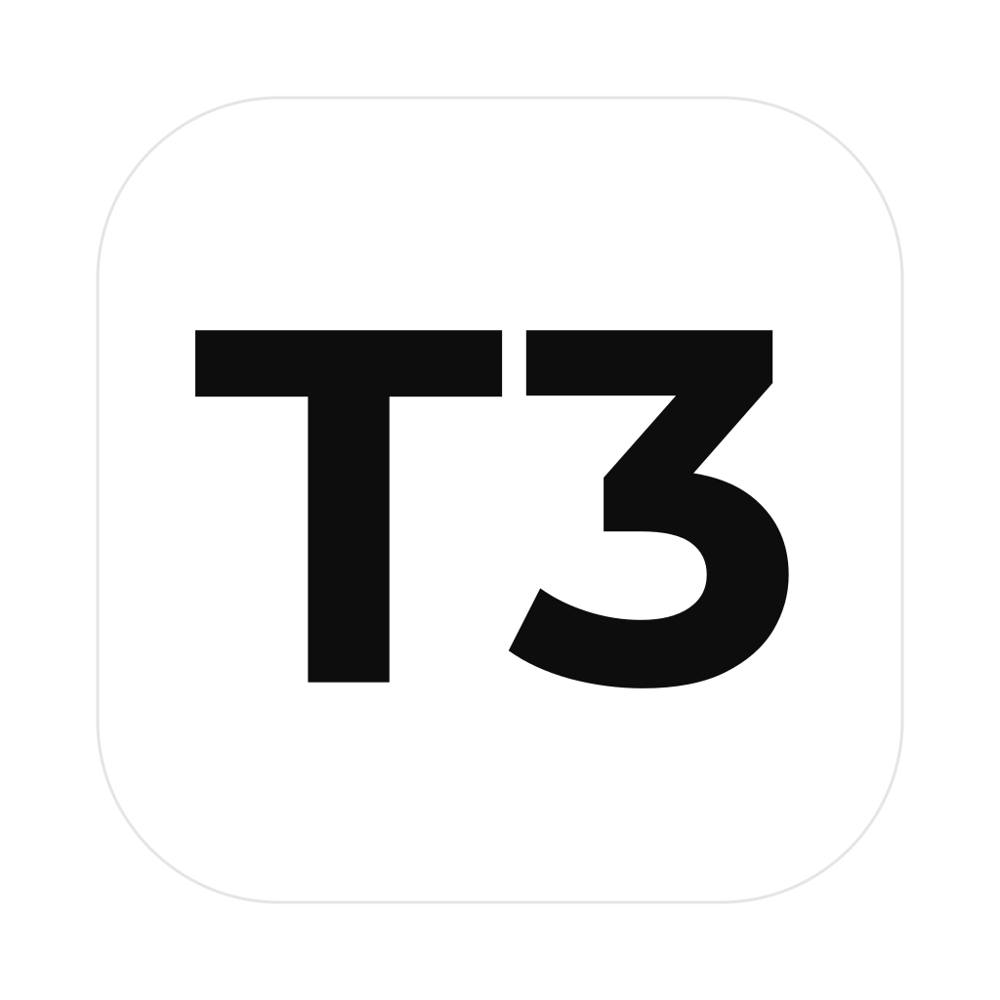

<div align="center">



# SimpleT3Code

T3 Code with the look and feel of the Codex desktop app.<br>
Same agents, same history, a quieter interface.

<br>

[](https://github.com/pingdotgg/t3code)
&nbsp;
[](./LICENSE)

</div>

<br>

## Quick start

There are no prebuilt downloads yet, so you build the app from source. On macOS:

```bash
git clone https://github.com/Marve10s/simple-t3code.git
cd simple-t3code
vp i
vp run dist:desktop:dmg
```

Open the `.dmg` in `release/` and drag SimpleT3Code into Applications. Windows and Linux steps are below.

<br>

## What's different from T3 Code

- **A Codex-style layout.** A slim top bar with back, forward, notifications and search, an icon rail, and a composer that sits in the middle of a new chat.
- **Three sidebar views.** Activity is T3 Code's activity sidebar. Projects groups chats under their project. Tabs hides the sidebar and opens chats as tabs across the top. Switch between them from the "…" menu on the rail.
- **Backgrounds on new chats.** Each new chat picks a random public-domain or Unsplash image. Add your own in Settings → Appearance.
- **Optional Motion animations.** Settings → Appearance → Motion → Animation style. Standard keeps T3 Code's animations. Motion adds smoother transitions and only loads when you pick it.
- **A single model picker.** Provider, model, reasoning effort and fast mode all live in one control.
- **Your T3 Code history.** On first launch SimpleT3Code copies your chats, settings and keybindings from T3 Code. It works on its own copy after that, so the two apps never share a database.

It installs next to T3 Code without replacing it and never updates itself into T3 Code.

<br>

## Before you start

SimpleT3Code drives the coding agents already installed on your computer. Install and sign in to at least one:

| Agent       | Install                                               | Sign in                                          |
| ----------- | ----------------------------------------------------- | ------------------------------------------------ |
| Codex       | [Codex CLI](https://developers.openai.com/codex/cli)  | `codex login`                                    |
| Claude      | [Claude Code](https://claude.com/product/claude-code) | `claude auth login`                              |
| Cursor      | [Cursor CLI](https://cursor.com/cli)                  | `agent login`                                    |
| Grok Build  | [Grok Build CLI](https://x.ai/cli)                    | `grok login`                                     |
| OpenCode    | [OpenCode](https://opencode.ai)                       | `opencode auth login`                            |
| Antigravity | Nothing to install                                    | Settings → **Install Antigravity**, then sign in |

Building also needs:

- [Node.js 24](https://nodejs.org/)
- [Vite+](https://viteplus.dev/guide/), which provides the `vp` command
- [Rust](https://rustup.rs), for the small native resource monitor bundled with the app

Install Vite+ on macOS or Linux:

```bash
curl -fsSL https://vite.plus | bash
```

On Windows, in PowerShell:

```powershell
irm https://vite.plus/ps1 | iex
```

<br>

## Install

### macOS

Install the Xcode Command Line Tools:

```bash
xcode-select --install
```

Then build a disk image for your Mac's architecture:

```bash
vp i
vp run dist:desktop:dmg
```

Open `release/SimpleT3Code-<version>-<arch>.dmg` and drag the app into Applications. Quit SimpleT3Code before replacing an older copy.

To build for the other architecture, use `vp run dist:desktop:dmg:arm64` or `vp run dist:desktop:dmg:x64` and add its Rust target first:

```bash
rustup target add aarch64-apple-darwin x86_64-apple-darwin
```

### Windows

Install Python 3 and [Visual Studio Build Tools](https://visualstudio.microsoft.com/visual-cpp-build-tools/) with **Desktop development with C++**, including the Windows SDK and the Spectre-mitigated MSVC libraries. Then add the Rust target and build the installer:

```powershell
rustup target add x86_64-pc-windows-msvc
vp i
vp run dist:desktop:win
```

Run the `.exe` installer from `release\`. For an ARM64 machine, add `aarch64-pc-windows-msvc` and run `vp run dist:desktop:win:arm64` instead.

### Linux

Build on Linux itself, because the app links against your system's libsecret. Install the build tools:

```bash
# Ubuntu and Debian
sudo apt-get install cargo rustc build-essential libsecret-1-dev pkg-config imagemagick

# Fedora
sudo dnf install rust cargo gcc gcc-c++ make libsecret-devel pkgconf-pkg-config ImageMagick

# Arch Linux
sudo pacman -S rust base-devel libsecret pkgconf imagemagick
```

Then build an AppImage:

```bash
vp i
vp run dist:desktop:linux
chmod +x release/SimpleT3Code-*.AppImage
./release/SimpleT3Code-*.AppImage
```

<br>

## Where your data lives

| What               | Location                                             |
| ------------------ | ---------------------------------------------------- |
| Chats and settings | `~/.simplet3` (`%USERPROFILE%\.simplet3` on Windows) |
| Imported from      | `~/.t3/userdata`, copied once on first launch        |

SimpleT3Code only reads T3 Code's data, and only once. Delete `~/.simplet3` to start over and import again on the next launch.

<br>

## Staying up to date

SimpleT3Code follows T3 Code's `main` branch. To pull in the latest upstream changes:

```bash
git remote add upstream https://github.com/pingdotgg/t3code.git   # once
pnpm merge-upstream
```

The script merges without committing and resolves the routine conflicts for you. [CONTRIBUTING.md](./CONTRIBUTING.md#merging-upstream) covers the rest.

<br>

## Community

[](https://x.com/IbrahimElkamali)
&nbsp;
[](https://t.me/TheCr1nge)
&nbsp;
[](https://github.com/Marve10s)

Found a bug in the SimpleT3Code interface? Open a [GitHub issue](https://github.com/Marve10s/simple-t3code/issues). Bugs in the agents, server or sync belong upstream in [T3 Code](https://github.com/pingdotgg/t3code/issues). Want to help? Read the [Contributing Guide](./CONTRIBUTING.md).

<br>

## License

MIT. SimpleT3Code is a fork of [T3 Code](https://github.com/pingdotgg/t3code) by [T3 Tools](https://t3.codes). All the agent, server and sync work is theirs. This fork changes the interface.
